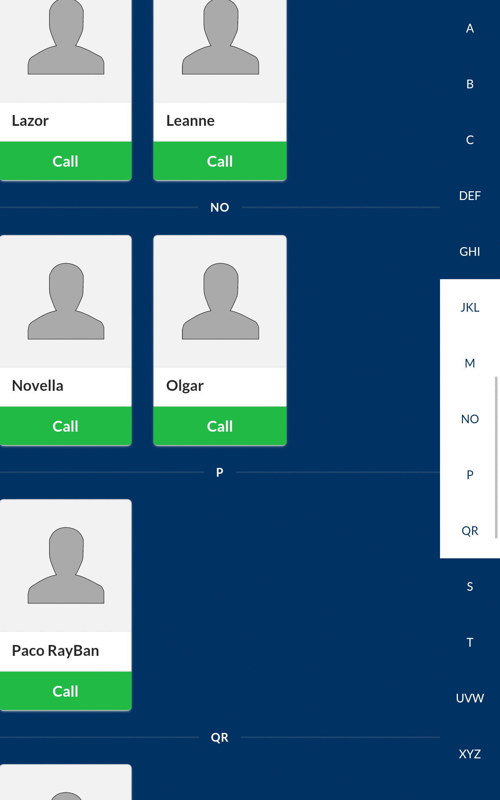

Door Phone App
==============

This app is installed onto an android tablet with a custom 'kiosk mode'.
It displays a fullscreen app with a list of companies pulled from the IP Cortex PABX which adapts its layout depending on the number of companies.



The app is running inside a crosswalk chrome webview which can be refreshed by sending a 'refresh' UDP packet to the tablet on port 9953. This is in case there is a problem caused by the network or similar and the tablet is attached to a wall so can't easily be manually reset.

The web application in the webview is in the `app/src/main/assets` folder.

Configuration
-------------
Configuration is done using a [TOML](https://github.com/toml-lang/toml) file on the tablet's storage. The app expects to find it at `/sdcard/DCIM/PBX/config.toml`. A sample one is found below:
```toml
[pbx]
hostname = "PABX HOSTNAME"
# Each tenant's Addressbook entry name should begin with the prefix below
user_prefix = "__de_"
    [pbx.credentials]
    username = "USER WITH WEBRTC LINE"
    password = "1234567"
```
This hostname is used to download the API files from the PABX.

Kiosk Mode
----------
The Kiosk Mode is achieved by disabling (as root) the launcher and systemui:
```shell
pm disable com.cyanogenmod.trebuchet
pm disable com.android.systemui
```
Make sure that ADB is enabled and that your host is authorized before running the above commands because the UI won't be accessible afterwards.

The screen timeouts and volume can be set either on the tablet before the previous disabling or by modifying the `settings.db` sqlite3 database via ADB.

To make the tablet power on upon connection to power, reboot the tablet to the bootloader and run from your USB host:
```shell
fastboot oem off-mode-charge 0
```
The app will run after boot if it is the only enabled launcher.

Before production use, it is useful to enable ADB over TCP but make sure that it is disabled when used in production. Root access should also be disabled.

[](https://github.com/feross/standard)
